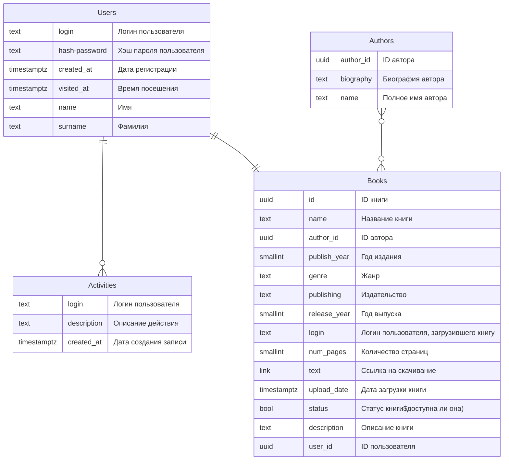

## Нереляционная модель

```json
Users {
    _id: ObjectId,
    login: String, // Логин пользователя
    hash_password: String, // Хэш пароля пользователя
    created_at: Date, // Дата регистрации
    visited_at: Date, // Время последнего посещения
    name: String, // Имя
    surname: String, // Фамилия
    activities: ObjectId[],
    books:  ObjectId[]
}

Activities {
    _id: ObjectId,
    user_id: ObjectId, // Ссылка на _id пользователя в коллекции Users
    description: String, // Описание действия
    created_at: Date // Дата создания записи
}

Books {
    _id: ObjectId,
    name: String, // Название книги
    author: ObjectId,
    publish_year: Number, // Год издания
    genre: String, // Жанр
    publishing: String, // Издательство
    release_year: Number, // Год выпуска
    uploaded_by: ObjectId,
    num_pages: Number, // Количество страниц
    link: String, // Ссылка на скачивание
    upload_date: Date, // Дата загрузки книги
    status: Boolean, // Статус книги (доступна ли она)
    description: String // Описание книги
}

Authors {
    _id: ObjectId,
    name: String, // Полное имя автора
    biography: String // Биография автора
    books: ObjectId[]
}

```

### Описание назначений коллекций

1. **Users**: Содержит информацию о пользователях (логин, пароль, дата регистрации, имя, фамилия).

2. **Activities**: Записи о действиях пользователей (описание действия, дата создания) связаны с `user_id` из `Users`.

3. **Books**: Хранит данные о книгах (название, автор, жанр, издательство, статус, описание) с вложенными ссылками на автора и загрузившего пользователя.

4. **Authors**: Данные об авторах (имя, биография) для связи с книгами через `author_id`.

Сущности связаны через `ObjectId`, объединяя пользователей, книги и авторов для отслеживания активности и принадлежности.

### Оценка объема информации

Для оценки объема информации, хранимой в модели, определим основной тип данных и создадим формулы для объема хранения. Пусть переменная `N` — это количество пользователей (Users). Память для остальных коллекций можно оценить на основе `N`, поскольку количество книг и действий связано с количеством пользователей. Предположим следующие коэффициенты связи:

- **Books**: Среднее количество книг на пользователя — `b` (например, 2 книги на пользователя).
- **Activities**: Среднее количество действий на пользователя — `a` (например, 5 действий на пользователя).
- **Authors**: Среднее количество уникальных авторов на книгу — `c` (например, 1 автор на книгу).

### Формулы расчета объема хранения

1. **Users**:

   - Средний объем пользователя (логин, пароль, даты, имя, фамилия) ≈ 300 байт.
   - Общий объем для Users: $300 * N$.

2. **Books**:

   - Средний объем книги (название, автор, год, издательство, статус) ≈ 500 байт.
   - Общее количество книг: $b * N$.
   - Общий объем для Books: $500 * b * N$.

3. **Activities**:

   - Средний объем записи об активности ≈ 200 байт.
   - Общее количество активностей: $a * N$.
   - Общий объем для Activities: $200 * a * N$.

4. **Authors**:
   - Средний объем автора (имя, биография) ≈ 400 байт.
   - Общее количество авторов: $c * b * N$.
   - Общий объем для Authors: $400 * c * b * N$.

Суммируем объемы всех коллекций:

$$
V = 300 \times N + 500 \times b \times N + 200\times a \times N + 400\times c \times b \times N
$$

### Избыточность модели

#### Чистый объем данных

1. **Users**:

   - Как в модели, нам нужно хранить логин, пароль, даты, имя, фамилию — эта информация уникальна для каждого пользователя.
   - Чистый объем для Users: $300 * N$.

2. **Books**:

   - Вместо хранения данных автора (имя, биография) в каждой книге, достаточно хранить ссылку на $author_id$.
   - Чистый объем книги сокращается до ≈ 400 байт (без дублирования автора).
   - Чистый объем для книг: $400 * b * N$.

3. **Activities**:

   - Чистый объем сохраняется как в модели, потому что каждый пользователь имеет свои уникальные действия.
   - Чистый объем для Activities: $200 * a * N$.

4. **Authors**:
   - Хранение уникальных авторов один раз.
   - Чистый объем для Authors: $400 * c * b * N$.

#### Чистый объем модели (V_clean)

Суммируя «чистые» объемы, получаем:

$$
V_{clean} = 300N + 400bN + 200aN + 400cbN
$$

$Подставляя выражения для $ V # и $ V\_{clean} #:

$$
R = \frac{300 N + 500 b N + 200 a N + 400 c b N }{300 N + 400bN + 200 a N + 400 c b N}
$$

### Направление роста модели

1. **Users** (`N`):

   - Линейный, пропорционален $N$, увеличивает как фактический объем, так и чистый объем данных, сохраняя примерно ту же избыточность.

2. **Books** (Среднее количество книг на пользователя, `b`):

   - Линейный, пропорционален $b$; избыточность модели также увеличивается, так как каждое изменение в данных книг требует обновлений ссылок и связанных данных (например, данные авторов).

3. **Activities** (Среднее количество действий на пользователя, `a`):

   - Линейный, пропорционален $a$; избыточность модели остается примерно на том же уровне, так как структура данных в Activities не имеет значительного дублирования.

4. **Authors** (Среднее количество уникальных авторов на книгу, `c`):

   - Линейный, пропорционален $c$; избыточность возрастает, так как каждая книга может иметь дополнительные связи и данные по автору, что увеличивает объем хранения данных в коллекции Books.

### Примеры хранения данных

Вот примеры данных для обновленной модели MongoDB:

### Примеры данных

#### Users

```json
{
    "_id": ObjectId("60d5f9f1fc13ae2f3b000001"),
    "login": "john_doe",
    "hash_password": "$2a$10$Wz57sHjQK8s1pL1Eq8IeUe",
    "created_at": ISODate("2024-01-15T08:30:00Z"),
    "visited_at": ISODate("2024-10-27T10:15:00Z"),
    "name": "John",
    "surname": "Doe",
    "activities": [ObjectId("60d5f9f1fc13ae2f3b000003"), ObjectId("60d5f9f1fc13ae2f3b000004")],
    "books": [ObjectId("60d5f9f1fc13ae2f3b000005")]
}
```

#### Activities

```json
{
    "_id": ObjectId("60d5f9f1fc13ae2f3b000003"),
    "user_id": ObjectId("60d5f9f1fc13ae2f3b000001"),
    "description": "Downloaded 'To Kill a Mockingbird'",
    "created_at": ISODate("2024-10-25T09:45:00Z")
}
```

#### Books

```json
{
    "_id": ObjectId("60d5f9f1fc13ae2f3b000005"),
    "name": "To Kill a Mockingbird",
    "author": ObjectId("60d5f9f1fc13ae2f3b000007"),
    "publish_year": 1960,
    "genre": "Fiction",
    "publishing": "J.B. Lippincott & Co.",
    "release_year": 1960,
    "uploaded_by": ObjectId("60d5f9f1fc13ae2f3b000001"),
    "num_pages": 281,
    "link": "https://library.example.com/download/to-kill-a-mockingbird",
    "upload_date": ISODate("2024-10-20T11:00:00Z"),
    "status": true,
    "description": "A novel about the serious issues of rape and racial inequality."
}
```

#### Authors

```json
{
    "_id": ObjectId("60d5f9f1fc13ae2f3b000007"),
    "name": "Harper Lee",
    "biography": "American novelist widely known for 'To Kill a Mockingbird'.",
    "books": [ObjectId("60d5f9f1fc13ae2f3b000005")]
}
```

### Примеры запросов

#### 1. Получение списка всех книг пользователя с их авторами и основными данными

**Сценарий использования**: Показать все книги, загруженные конкретным пользователем, вместе с информацией об авторе.

```javascript
db.Users.findOne({ login: "john_doe" }).then((user) => {
	return db.Books.find({ uploaded_by: user._id }).populate("author").exec();
});
```

#### 2. Получение всех действий пользователя

**Сценарий использования**: Просмотреть историю действий конкретного пользователя.

```javascript
db.Activities.find({ user_id: ObjectId("60d5f9f1fc13ae2f3b000001") }).sort({ created_at: -1 });
```

#### 3. Поиск книг по жанру и статусу доступности

**Сценарий использования**: Показать доступные книги определенного жанра, например, для категории «Фантастика».

```javascript
db.Books.find({ genre: "Science Fiction", status: true });
```

#### 4. Получение списка всех книг автора

**Сценарий использования**: Найти все книги, написанные конкретным автором, для отображения библиографии.

```javascript
db.Authors.findOne({ name: "Leo Tolstoy" }).then((author) => {
	return db.Books.find({ author: author._id });
});
```

#### 5. Получение информации о пользователе вместе с загруженными книгами и действиями

**Сценарий использования**: Просмотреть профиль пользователя с его действиями и загруженными книгами.

```javascript
db.Users.findOne({ login: "john_doe" }).populate("books").populate("activities").exec();
```

## Реляционная модель

### Графическое представление модели



### Описание назначений коллекций, типов данных и сущностей

Для вашей библиотеки предлагается структура, в которой каждое назначение коллекции и тип данных определены следующим образом:

### Описание Коллекций

1. **Users** - Коллекция для хранения информации о пользователях библиотеки. Эта коллекция включает данные, которые позволяют идентифицировать пользователя, отслеживать его активность и предоставить информацию для входа.

   - `login` (text): Логин пользователя, уникальный идентификатор для аутентификации.
   - `hash-password` (text): Хэш пароля пользователя для обеспечения безопасности.
   - `created_at` (timestamptz): Дата регистрации пользователя.
   - `visited_at` (timestamptz): Время последнего посещения.
   - `name` (text): Имя пользователя.
   - `surname` (text): Фамилия пользователя.

2. **Activities** - Коллекция, предназначенная для записи активности пользователей. Она хранит каждое действие, выполняемое пользователем, что позволяет отслеживать историю активности и улучшать взаимодействие с системой.

   - `login` (text): Логин пользователя, связанного с активностью.
   - `description` (text): Описание действия, выполненного пользователем.
   - `created_at` (timestamptz): Дата и время создания записи об активности.

3. **Books** - Коллекция, которая хранит данные о книгах в библиотеке. Она включает метаданные о книге, информацию о загрузившем пользователе и статус книги в системе.

   - `id` (uuid): Уникальный идентификатор книги.
   - `name` (text): Название книги.
   - `author_id` (uuid): Уникальный идентификатор автора, связанный с книгой.
   - `publish_year` (smallint): Год издания книги.
   - `genre` (text): Жанр книги.
   - `publishing` (text): Издательство книги.
   - `release_year` (smallint): Год выпуска (первого издания).
   - `login` (text): Логин пользователя, загрузившего книгу в библиотеку.
   - `num_pages` (smallint): Количество страниц в книге.
   - `link` (text): Ссылка на скачивание книги.
   - `upload_date` (timestamptz): Дата загрузки книги в библиотеку.
   - `status` (bool): Статус книги, указывает, доступна ли она для скачивания или чтения.
   - `description` (text): Описание книги.
   - `user_id` (uuid): Уникальный идентификатор пользователя, связанный с книгой.

4. **Authors** - Коллекция, хранящая данные об авторах книг, доступных в библиотеке. Она содержит биографические данные и полное имя автора.
   - `author_id` (uuid): Уникальный идентификатор автора.
   - `biography` (text): Биография автора.
   - `name` (text): Полное имя автора.

### Связи

- **Authors - Books**: Один автор может иметь несколько книг в библиотеке, создавая связь один-ко-многим (`}o--o{`).
- **Users - Activities**: Один пользователь может быть связан с несколькими действиями, что делает эту связь один-ко-многим (`||--o{`).
- **Users - Books**: Один пользователь может загрузить несколько книг, связывая пользователей с их загрузками через отношение один-к-одному (`||--||`), в зависимости от того, как будет использоваться логин или ID пользователя.

### Оценка объема информации, хранимой в модели

### 1. Users

Каждый объект в коллекции `Users` включает следующие поля:

- `login`: текстовое поле (30 символов) — 30 байт
- `hash-password`: текстовое поле (60 символов) — 60 байт
- `created_at`: временная метка — 8 байт
- `visited_at`: временная метка — 8 байт
- `name`: текстовое поле (30 символов) — 30 байт
- `surname`: текстовое поле (30 символов) — 30 байт

**Итог**: 166 байт на одного пользователя.

### 2. Activities

Предположим, что каждый пользователь выполняет в среднем $ a $ действий. Каждый объект `Activities` включает:

- `login`: текстовое поле (30 символов) — 30 байт
- `description`: текстовое поле (100 символов) — 100 байт
- `created_at`: временная метка — 8 байт

**Итог**: 138 байт на каждое действие.

**Общий объем для `Activities`**: $ 138 \times a \times n $ байт.

### 3. Books

Допустим, в среднем каждый пользователь загружает $ b $ книг. Каждый объект `Books` содержит:

- `id`: UUID — 16 байт
- `name`: текстовое поле (50 символов) — 50 байт
- `author_id`: UUID — 16 байт
- `publish_year`: smallint — 2 байта
- `genre`: текстовое поле (30 символов) — 30 байт
- `publishing`: текстовое поле (30 символов) — 30 байт
- `release_year`: smallint — 2 байта
- `login`: текстовое поле (30 символов) — 30 байт
- `num_pages`: smallint — 2 байта
- `link`: текстовое поле (100 символов) — 100 байт
- `upload_date`: временная метка — 8 байт
- `status`: bool — 1 байт
- `description`: текстовое поле (200 символов) — 200 байт
- `user_id`: UUID — 16 байт

**Итог**: 533 байта на книгу.

**Общий объем для `Books`**: $ 533 \times b \times n $ байт.

### 4. Authors

Допустим, в библиотеке $c $ авторов, где каждый автор добавляет в среднем $ \frac{n \times b}{c} $ книг. Каждый объект `Authors` включает:

- `author_id`: UUID — 16 байт
- `biography`: текстовое поле (500 символов) — 500 байт
- `name`: текстовое поле (50 символов) — 50 байт

**Итог**: 566 байт на автора.

### Общий объем памяти

Теперь, используя $ n $ как количество пользователей, можем выразить общий объем через $ n $:

$$
V(n) = 166n + 138 \cdot a \cdot n + 533 \cdot b \cdot n + 566 \cdot c
$$

где:

- $ n $ — количество пользователей,
- $ a $ — среднее количество действий на пользователя,
- $ b $ — среднее количество книг, загружаемых пользователем,
- $ c $ — количество уникальных авторов.

### Избыточность модели

#### «Чистый» объем данных

Для каждого типа данных определим поля, которые составляют минимальную информацию:

1. **Users**:

   - `login` — уникальный идентификатор пользователя, необходим для всех операций.
   - `hash-password` — хранение пароля (хеш) для авторизации.

   **Чистый объем на пользователя**: $ 30 + 60 = 90 $ байт.

2. **Activities**:

   - `login` — идентификатор пользователя для связи действия с пользователем.
   - `description` — описание действия, выполняемого пользователем.

   **Чистый объем на действие**: $ 30 + 100 = 130 $ байт.

3. **Books**:

   - `id` — уникальный идентификатор книги.
   - `name` — название книги.
   - `author_id` — идентификатор автора книги.

   **Чистый объем на книгу**: $ 16 + 50 + 16 = 82 $ байта.

4. **Authors**:

   - `author_id` — уникальный идентификатор автора.
   - `name` — полное имя автора.

   **Чистый объем на автора**: $ 16 + 50 = 66 $ байт.

Теперь, исходя из количества пользователей $ n $, среднего количества действий $ a $, среднего количества книг на пользователя $ b $ и общего количества авторов $ c $, получаем «чистый» объем данных:

$$
V\_{\text{чистый}}(n) = 90n + 130 \cdot a \cdot n + 82 \cdot b \cdot n + 66 \cdot c
$$

Подставляем выражения:

$$
K(n) = \frac{166n + 138 \cdot a \cdot n + 533 \cdot b \cdot n + 566 \cdot c}{90n + 130 \cdot a \cdot n + 82 \cdot b \cdot n + 66 \cdot c}
$$

### Направление роста модели при увеличении количества объектов каждой сущности.

При увеличении количества объектов:

1. **Users ($ n $)** — объем данных растет линейно, пропорционально числу пользователей.

2. **Activities ($ a \times n $)** — объем растет линейно по числу действий на пользователя, добавляя значительные данные при увеличении активности.

3. **Books ($ b \times n $)** — объем также линейно растет с числом книг на пользователя и оказывает самый сильный эффект на общий объем, так как данные о книгах занимают много места.

4. **Authors ($ c $)** — объем растет линейно, но вклад авторов в общий объем относительно мал.

**Итог**: Основной объем данных будет расти линейно с увеличением пользователей, книг на пользователя и действий на пользователя, с наибольшим влиянием от данных о книгах.

### Примеры хранения данных в БД для модели

#### Users Table

| login | hash_password | created_at          | visited_at          | name  | surname |
| ----- | ------------- | ------------------- | ------------------- | ----- | ------- |
| user1 | hash1         | 2023-01-01 12:00:00 | 2024-01-01 15:00:00 | Alice | Smith   |
| user2 | hash2         | 2023-01-15 14:30:00 | 2024-01-15 13:00:00 | Bob   | Johnson |

#### Activities Table

| login | description       | created_at          |
| ----- | ----------------- | ------------------- |
| user1 | Logged in         | 2024-01-01 15:00:00 |
| user2 | Uploaded a book   | 2024-01-15 13:05:00 |
| user1 | Downloaded a book | 2024-01-20 16:20:00 |

#### Books Table

| id                                   | name     | author_id                            | publish_year | genre   | publishing  | release_year | login | num_pages | link                     | upload_date         | status | description              | user_id                              |
| ------------------------------------ | -------- | ------------------------------------ | ------------ | ------- | ----------- | ------------ | ----- | --------- | ------------------------ | ------------------- | ------ | ------------------------ | ------------------------------------ |
| ce14128d-c8c7-41d5-bb40-398e26dae257 | Book One | 5aa508b3-fa73-40fb-b63a-67fbd7fdef0f | 2010         | Fiction | Publisher A | 2011         | user1 | 300       | http://example.com/book1 | 2024-01-15 13:05:00 | True   | A fascinating story.     | 98bc1bb6-f3c3-4be1-b952-6c10f1dfaf3d |
| b27d3800-e49a-4d50-a67c-6ec1a7a8fd63 | Book Two | d79ba7d3-9a62-4e3b-9fa5-6678fb44ff0f | 2015         | Science | Publisher B | 2016         | user2 | 400       | http://example.com/book2 | 2024-01-18 11:00:00 | False  | A detailed science book. | e33bbb8d-2b5b-459c-9039-ebbfb11d9651 |

#### Authors Table

| author_id                            | biography             | name       |
| ------------------------------------ | --------------------- | ---------- |
| 994dd275-0f1c-414d-8ae3-902c0a2b83b1 | Biography of Author 1 | Author One |
| ffc54350-d9c5-482c-93b4-dd89f5fcb952 | Biography of Author 2 | Author Two |

### Примеры запросов

Вот примеры запросов к модели, с помощью которых можно реализовать различные сценарии использования, такие как авторизация, загрузка книг, просмотр книг и информации о действиях пользователей. Также приведены зависимости количества запросов от числа объектов в базе данных и другие параметры.

---

### Примеры запросов

1. **Авторизация пользователя (поиск пользователя по логину и проверка пароля)**

   ```sql
   SELECT *
   FROM Users
   WHERE login = 'user_login'
     AND hash_password = 'hashed_password';
   ```

2. **Регистрация действия пользователя (логирование действий)**

   ```sql
   INSERT INTO Activities (login, description, created_at)
   VALUES ('user_login', 'Downloaded a book', NOW());
   ```

3. **Добавление новой книги**

   ```sql
   INSERT INTO Books (name, author_id, publish_year, genre, publishing, release_year, login, num_pages, link, upload_date, status, description, user_id)
   VALUES ('Book Title', 'e33bbb8d-2b5b-459c-9039-ebbfb11d9651', 2020, 'Genre', 'Publisher', 2020, 'user_login', 350, 'http://example.com/book', NOW(), TRUE, 'Book description', 'user_uuid');
   ```

4. **Поиск книги по названию или жанру**

   ```sql
   SELECT *
   FROM Books
   WHERE name ILIKE '%book_name%' OR genre ILIKE '%genre%';
   ```

5. **Получение всех книг, загруженных определенным пользователем**

   ```sql
   SELECT *
   FROM Books
   WHERE login = 'user_login';
   ```

6. **Получение списка всех авторов**

   ```sql
   SELECT *
   FROM Authors;
   ```

7. **Получение информации о действиях пользователя**

   ```sql
   SELECT *
   FROM Activities
   WHERE login = 'user_login'
   ORDER BY created_at DESC;
   ```

---

#### Количество запросов для юзкейсов в зависимости от числа объектов в БД и параметров

- **Авторизация**: 1 запрос вне зависимости от количества объектов, поскольку это проверка конкретного пользователя.
- **Регистрация действия**: 1 запрос на каждое действие пользователя.
- **Добавление книги**: 1 запрос на каждую новую книгу.
- **Поиск книги**: Зависит от количества книг в базе. Чем больше книг, тем больше потенциальных записей, которые могут быть возвращены, особенно при использовании LIKE.
- **Получение книг пользователя**: 1 запрос на пользователя, но результат зависит от числа книг, загруженных пользователем.
- **Получение списка авторов**: 1 запрос для всей коллекции, независимо от количества авторов.
- **Получение действий пользователя**: 1 запрос на пользователя, но количество возвращаемых записей зависит от количества действий.

---

### Количество задействованных коллекций

Все коллекции могут быть задействованы в зависимости от юзкейса, с максимальной активностью у коллекций `Users`, `Books`, и `Activities`.

## Сравнение моделей

1. Структура данных:

   - Нереляционная модель более свободная и гибкая, тогда как реляционная модель строго структурирована. В нашем случае, использование NoSQL базы данных сильно удобнее, так как один объект может хранить в себе массив идентификаторов другой сущности.

2. Целостность данных:

   - Реляционная модель предлагает большую защиту целостности данных благодаря ограничениям, тогда как в нереляционная модели может быть труднее поддерживать целостность.

3. Гибкость:

   - Нереляционная модель позволяет более быстро вносить изменения и адаптироваться к изменениям требований, в то время как реляционная модель может требовать значительных усилий при изменениях.

4. Производительность:
   - В зависимости от размера данных и частоты запросов, производительность может отличаться: реляционные базы данных часто оптимизированы для сложных запросов, тогда как нереляционная могут быть быстрее для определенных типов операций.

## Вывод

Проект имеет структуру с вложенными данными и ориентирован на простые повторяющиеся запросы. В таком случае нереляционная модель представляется подходящим вариантом.
